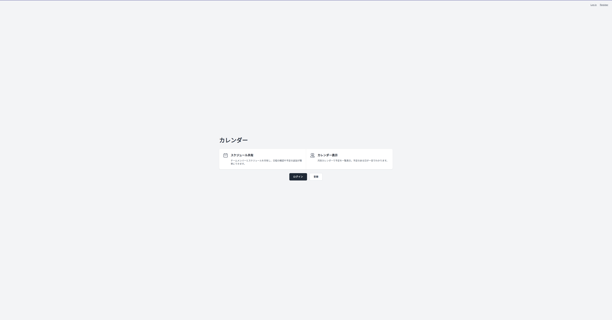
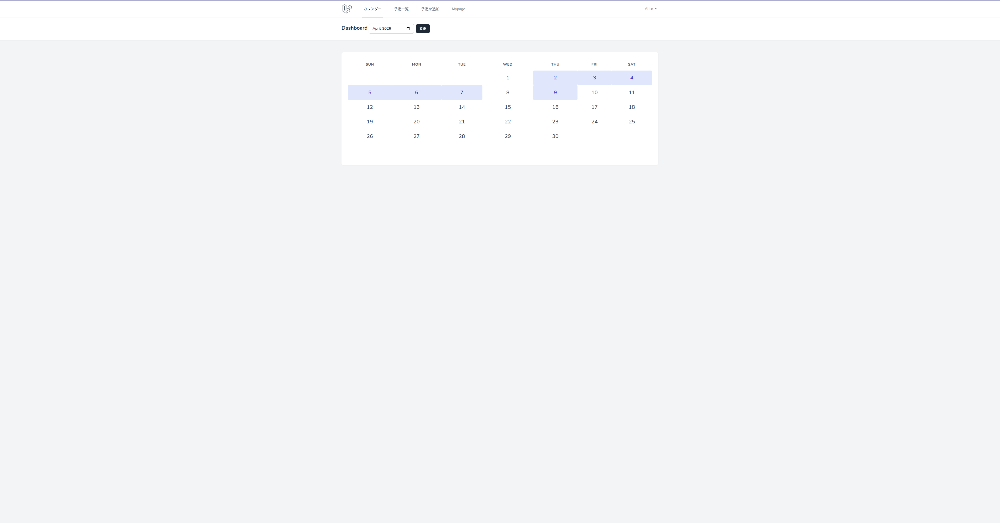
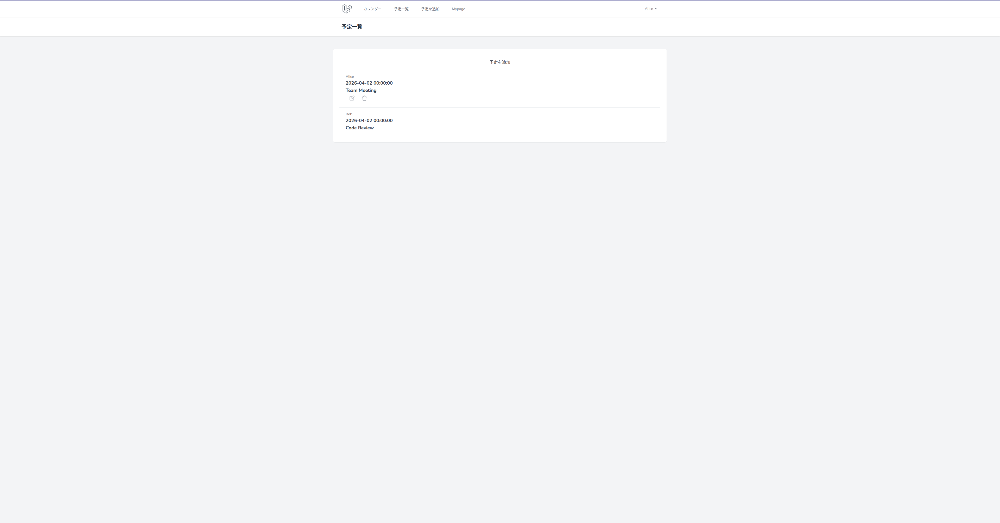
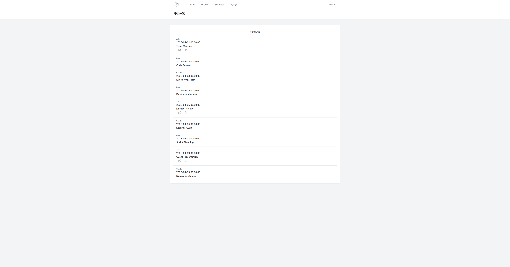
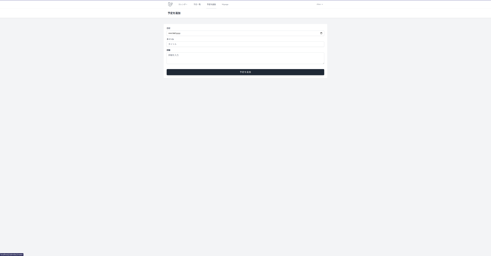
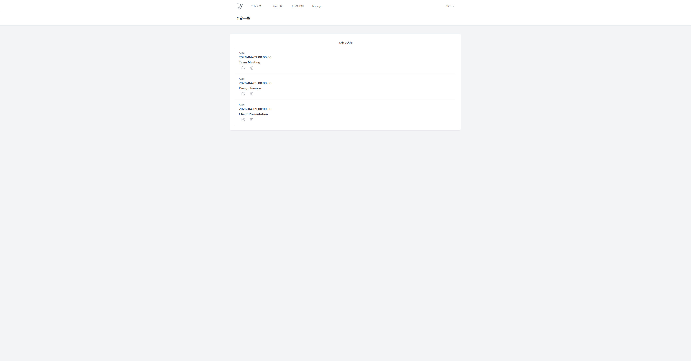

# Calendar App

[English](README.md) | 日本語

Laravel で構築したスケジュール共有カレンダーアプリケーションです。複数ユーザー間でスケジュールを共有し、日程の確認・予定の追加・詳細表示ができます。

## スクリーンショット

| トップページ | カレンダー |
|:---:|:---:|
|  |  |

| 日付別表示 | 予定一覧 |
|:---:|:---:|
|  |  |

| 予定追加 | マイページ |
|:---:|:---:|
|  |  |

## 機能

- **カレンダー共有** — 月別カレンダーで予定のある日をハイライト表示
- **予定管理** — 予定の作成・閲覧・編集・削除（CRUD）
- **マイページ** — 自分の予定だけを一覧表示
- **認証** — Laravel Breeze によるユーザー登録・ログイン
- **月ナビゲーション** — 月単位でカレンダーを切り替え

## 技術スタック

- **バックエンド**: PHP 8.0+ / Laravel 9
- **認証**: Laravel Breeze / Sanctum
- **フロントエンド**: Blade テンプレート、Tailwind CSS、Vite
- **データベース**: MySQL 8.0
- **インフラ**: Docker (Laravel Sail)

## 前提条件

- Docker & Docker Compose

## セットアップ

```bash
# リポジトリをクローン
git clone https://github.com/shutouyusei/calendar.git
cd calendar

# Composer 依存パッケージをインストール（一時コンテナ使用）
docker run --rm -v $(pwd):/app composer:2.5 install --ignore-platform-reqs

# 環境設定
cp .env.example .env

# コンテナをビルド・起動
./vendor/bin/sail build
./vendor/bin/sail up -d

# アプリケーションキーを生成
./vendor/bin/sail artisan key:generate

# マイグレーション実行・デモデータ投入
./vendor/bin/sail artisan migrate
./vendor/bin/sail artisan db:seed

# フロントエンドのインストール・ビルド
./vendor/bin/sail npm install
./vendor/bin/sail npm run build
```

`http://localhost` でアプリケーションにアクセスできます。

### デモアカウント

| 名前 | メール | パスワード |
|------|--------|-----------|
| Alice | alice@example.com | password |
| Bob | bob@example.com | password |
| Charlie | charlie@example.com | password |

## 使い方

1. デモアカウントでログイン、または新規登録
2. ダッシュボードに月別カレンダーが表示され、予定のある日がハイライトされます
3. 日付をクリックすると、その日の全ユーザーの予定が表示されます
4. 「予定を追加」から日付・タイトル・詳細を入力して予定を作成
5. 予定をクリックして詳細表示・編集・削除
6. 「Mypage」で自分の予定だけを確認

## テスト

```bash
./vendor/bin/sail test
```

## ライセンス

[MIT License](LICENSE)
